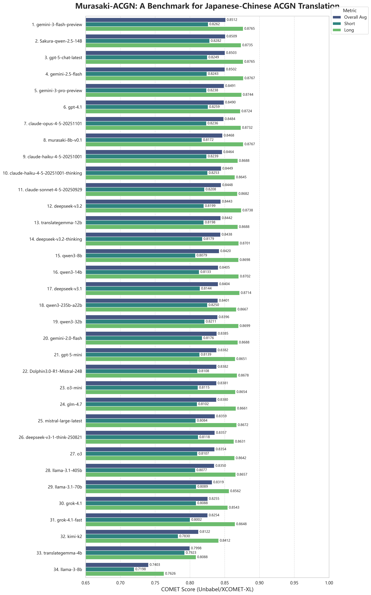
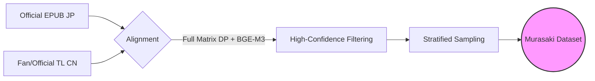

<div align="center">

<h1>Murasaki Benchmark</h1>

<p>
  <strong>A Comprehensive Benchmark for Evaluating Japanese-to-Chinese ACGN Translation Quality</strong>
</p>

<p>
  <a href="https://github.com/your-repo/murasaki-benchmark/blob/main/LICENSE">
    
  </a>
  
  
  
</p>

<p>
  <a href="#-leaderboard">📊 Leaderboard</a> •
  <a href="#-methodology">🛠️ Methodology</a> •
  <a href="#-quick-start">🚀 Quick Start</a> •
  <a href="#-citation">📝 Citation</a>
</p>

<br>



</div>

<br>

> **Murasaki Benchmark** provides two paragraph-level datasets (Short/Long) to evaluate how well LLM translations align with professional human references in the **ACGN domain**. Using XCOMET metric, we measure the semantic similarity between machine translations and authoritative reference translations at the paragraph level.

---

## Leaderboard

We evaluated **SOTA commercial and mainstream open-source LLMs** using the XCOMET metric.

| Rank | Model | Short | Long | Avg |
|:----:|:-----|:------:|:------:|:----:|
| 🥇 | **Gemini 3 Flash Preview** | 0.826 | 0.877 | **0.851** |
| 🥈 | **Sakura-Qwen-2.5-14B** | 0.828 | 0.874 | **0.851** |
| 🥉 | **GPT-5-chat-latest** | 0.825 | 0.877 | **0.850** |
| 4 | Gemini 2.5 Flash | 0.824 | 0.877 | 0.850 |
| 5 | Gemini 3 Pro Preview | 0.824 | 0.874 | 0.849 |
| 6 | GPT-4.1 | 0.826 | 0.872 | 0.849 |
| 7 | Claude Opus 4.5 | 0.824 | 0.873 | 0.848 |
| 8 | Murasaki-8B-v0.1 | 0.817 | 0.877 | 0.847 |
| 9 | Claude Haiku 4.5 | 0.824 | 0.869 | 0.846 |
| 10 | Claude Haiku 4.5 Thinking | 0.825 | 0.865 | 0.845 |
| 11 | Claude Sonnet 4.5 | 0.821 | 0.868 | 0.845 |
| 12 | DeepSeek V3.2 | 0.820 | 0.874 | 0.844 |
| 13 | TranslateGemma 12B | 0.820 | 0.869 | 0.844 |
| 14 | DeepSeek V3.2 Thinking | 0.818 | 0.870 | 0.844 |
| 15 | Qwen3-8B | 0.808 | 0.870 | 0.842 |
| 16 | Qwen3-14B | 0.813 | 0.870 | 0.841 |
| 17 | DeepSeek V3.1 | 0.814 | 0.871 | 0.840 |
| 18 | Qwen3-235B-A22B | 0.825 | 0.867 | 0.840 |
| 19 | Qwen3-32B | 0.821 | 0.870 | 0.840 |
| 20 | Gemini 2.0 Flash | 0.818 | 0.869 | 0.838 |
| 21 | GPT-5-mini | 0.814 | 0.865 | 0.838 |
| 22 | Dolphin3.0-R1-Mistral-24B | 0.811 | 0.868 | 0.838 |
| 23 | o3-mini | 0.811 | 0.865 | 0.838 |
| 24 | GLM-4.7 | 0.810 | 0.866 | 0.838 |
| 25 | Mistral Large | 0.808 | 0.867 | 0.836 |
| 26 | DeepSeek V3.1 Think | 0.812 | 0.863 | 0.836 |
| 27 | o3 | 0.811 | 0.864 | 0.835 |
| 28 | Llama-3.1-405B | 0.808 | 0.866 | 0.835 |
| 29 | Llama-3.1-70B | 0.809 | 0.856 | 0.832 |
| 30 | Grok-4.1 | 0.809 | 0.854 | 0.825 |
| 31 | Grok-4.1-fast | 0.800 | 0.865 | 0.825 |
| 32 | Kimi-K2 | 0.783 | 0.841 | 0.812 |
| 33 | TranslateGemma 4B | 0.792 | 0.809 | 0.800 |
| 34 | Llama-3-8B | 0.720 | 0.763 | 0.740 |

Full results: [results/final_comet_scores.jsonl](results/final_comet_scores.jsonl)

---

## Key Features

* **Paragraph-Level Evaluation** — Two datasets (Short: 180-200 chars, Long: 780-800 chars) for comprehensive paragraph translation assessment.
* **Authoritative References** — Human translations from established fan groups and official Traditional Chinese releases.
* **XCOMET-Based Scoring** — Measures semantic alignment between LLM output and reference translations using neural evaluation.
* **Fair Comparison** — Standardized `temperature=1.0` and unified prompts ensure reproducible, comparable results.

---

## 🛠️ Methodology

### Data Pipeline



### Data Post-processing
To ensure fair scoring, we apply rigorous **anomaly detection** to all model outputs before evaluation.
- **Empty Check**: Outputs that are completely empty are removed.
- **Length Ratio Check**: Outputs with a length ratio (Output/Source) `< 0.1` (too short) or `> 4.0` (hallucination loops) are excluded.
- **Safety Refusals**: Explicit refusals (e.g., "I cannot assist...") are treated as invalid and filtered.
*(This ensures that 0-score anomalies do not skew the distribution of valid translation scores.)*


> **⚠️ Known Issues**
> Some models exhibit significant issues in generation structure or content, resulting in a large number of samples being filtered out by the data cleaning process. Their final scores are calculated based on a small number of valid samples and **may not represent their true performance**:
> * **Qwen3-8B**: Extremely low valid rate (~24.5%), outputs contain excessive repetition or gibberish.
> * **Grok-4.1 / Grok-4.1-fast**: Valid rate only 50-60%, long text generation is highly unstable.
> * **DeepSeek-V3.1 / Qwen3-32B**: Low valid rate for long text, prone to truncation or formatting errors.

### Data Quality Report (Valid/Total)

| Model | Short | Long | Valid Rate |
|:------|:-----:|:----:|:----------:|
| claude-haiku-4-5-20251001 | 100/100 | 100/100 | 100.0% |
| claude-opus-4-5-20251101 | 100/100 | 100/100 | 100.0% |
| murasaki-8b-v0.1 | 100/100 | 99/99 | 100.0% |
| claude-haiku-4-5-20251001-thinking | 100/100 | 100/100 | 100.0% |
| Sakura-qwen-2.5-14B | 100/100 | 100/100 | 100.0% |
| gemini-3-pro-preview | 100/100 | 100/100 | 100.0% |
| gemini-3-flash-preview | 100/100 | 99/100 | 99.5% |
| glm-4.7 | 100/100 | 99/100 | 99.5% |
| kimi-k2 | 99/100 | 100/100 | 99.5% |
| deepseek-v3.2-thinking | 100/100 | 99/100 | 99.5% |
| translategemma-12b | 99/100 | 100/100 | 99.5% |
| gpt-4.1 | 100/100 | 98/100 | 99.0% |
| gemini-2.5-flash | 100/100 | 98/100 | 99.0% |
| gpt-5-chat-latest | 100/100 | 97/100 | 98.5% |
| o3 | 99/99 | 85/88 | 98.4% |
| o3-mini | 99/100 | 97/100 | 98.0% |
| claude-sonnet-4-5-20250929 | 96/100 | 99/100 | 97.5% |
| llama-3.1-70b | 100/100 | 94/100 | 97.0% |
| qwen3-14b | 98/100 | 90/100 | 94.0% |
| gpt-5-mini | 97/100 | 88/100 | 92.5% |
| translategemma-4b | 92/100 | 92/100 | 92.0% |
| Dolphin3.0-R1-Mistral-24B | 95/100 | 88/100 | 91.5% |
| deepseek-v3-1-think-250821 | 96/100 | 84/100 | 90.0% |
| mistral-large-latest | 95/100 | 84/100 | 89.5% |
| llama-3.1-405b | 90/100 | 80/100 | 85.0% |
| deepseek-v3.2 | 92/100 | 76/100 | 84.0% |
| gemini-2.0-flash | 97/100 | 67/100 | 82.0% |
| llama-3-8b | 85/100 | 78/100 | 81.5% |
| qwen3-32b | 91/100 | 56/100 | 73.5% |
| qwen3-235b-a22b | 92/100 | 52/100 | 72.0% |
| grok-4.1-fast | 72/100 | 46/100 | 59.0% |
| deepseek-v3.1 | 63/100 | 53/100 | 58.0% |
| grok-4.1 | 71/100 | 41/100 | 56.0% |
| qwen3-8b | 22/100 | 27/100 | 24.5% |

### Dataset Composition

| Category | Samples | Length (chars) | Content Type |
|----------|:-------:|:--------------:|--------------|
| **Short** | 100 | 180-200 | Dialogues, witty retorts, short descriptions |
| **Long** | 100 | 780-800 | Complex world-building, emotional monologues |

Covers major genres from commercial light novels and *Syosetu* web novels:

<details>
<summary><strong>🔍 Click to see Genre Coverage</strong></summary>

| Genre | Representative Works |
|-------|----------------------|
| **Isekai** | *Mushoku Tensei*, *TenSura*, *Shield Hero* |
| **RomCom** | *My Teen Romantic Comedy SNAFU*, *Oreimo*, *Kaguya-sama* |
| **Fantasy** | *SAO*, *KonoSuba*, *Spice and Wolf* |
| **Sci-Fi** | *86*, *Full Metal Panic* |
| **Slice of Life** | *Angel Next Door*, *Gimai Seikatsu* |
| **Mystery** | *Hyouka*, *Monogatari Series* |
| **War/Political** | *Youjo Senki*, *Legend of the Galactic Heroes* |

</details>

### Evaluation Protocol

| Parameter | Value |
|-----------|-------|
| Temperature | 1.0 |
| System Prompt | Standardized ([pipeline/config.py](pipeline/config.py)) |
| Special Cases | Sakura & Murasaki-8B models use custom settings |
| Metric | COMET (Unbabel/XCOMET-XL) |

---

## 🚀 Quick Start

### Installation

```bash
git clone https://github.com/soundstarrain/murasaki-benchmark
cd murasaki-benchmark
pip install -r requirements.txt
```

### Run Evaluation

**Option 1: Local Model (e.g., Qwen via Ollama)**
```bash
ollama pull qwen2.5:14b
python examples/local_llm_demo.py
```

**Option 2: API Provider**
```bash
cp .env.example .env
# Edit .env with your API credentials
python examples/api_eval_demo.py
```

> For detailed configuration, refer to [docs/local_deployment.md](docs/local_deployment.md).

---

## 📂 Project Structure

```text
murasaki-benchmark/
├── 📂 data/           # Benchmark datasets (Short/Long splits)
├── 📂 pipeline/       # Core evaluation logic (Prompting, Scoring)
├── 📂 examples/       # Minimal runnable scripts
├── 📂 results/        # Full evaluation logs & charts
└── 📂 docs/           # Detailed documentation
```

---

## 📝 Citation

If you find this benchmark useful, please cite our work:

```bibtex
@misc{murasaki2026,
  title={Murasaki Benchmark: An ACGN Translation Benchmark for LLMs},
  author={Murasaki Team},
  year={2026},
  url={https://github.com/soundstarrain/murasaki-benchmark}
}
```

---

## 📄 License

This project is licensed under the [GPL-3.0 License](LICENSE).

> The dataset is intended for **research purposes only**. Copyrights of the original novels and translations belong to their respective owners.
