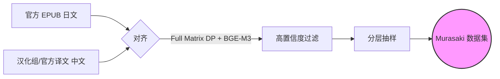

<div align="center">

<h1>Murasaki Benchmark</h1>

<p>
  <strong>大语言模型日语→中文 ACGN 翻译质量评测基准</strong>
</p>

<p>
  <a href="https://github.com/soundstarrain/murasaki-benchmark/blob/main/LICENSE">
    
  </a>
  
  
  
</p>

<p>
  <a href="#-排行榜">📊 排行榜</a> •
  <a href="#-方法论">🛠️ 方法论</a> •
  <a href="#-快速开始">🚀 快速开始</a> •
  <a href="#-引用">📝 引用</a>
</p>

<br>


</div>

<br>

> **Murasaki Benchmark** 提供两个段落级数据集（Short/Long），用于评测 LLM 翻译与专业人工译文在 **ACGN 领域**的对齐程度。通过 XCOMET 指标，我们在段落层面衡量机器翻译与权威参考译文之间的语义相似度。

---

## 排行榜

我们使用 XCOMET 指标评测了**主流商业模型和开源模型**的日中 ACGN 翻译能力。

| 排名 | 模型 | 短文本 | 长文本 | 平均 |
|:----:|:-----|:------:|:------:|:----:|
| 🥇 | **Gemini 3 Flash Preview** | 0.826 | 0.877 | **0.851** |
| 🥈 | **Sakura-Qwen-2.5-14B** | 0.828 | 0.874 | **0.851** |
| 🥉 | **GPT-5-chat-latest** | 0.825 | 0.877 | **0.850** |
| 4 | Gemini 2.5 Flash | 0.824 | 0.877 | 0.850 |
| 5 | Gemini 3 Pro Preview | 0.824 | 0.874 | 0.849 |
| 6 | GPT-4.1 | 0.826 | 0.872 | 0.849 |
| 7 | Claude Opus 4.5 | 0.824 | 0.873 | 0.848 |
| 8 | Murasaki-8B-v0.1 | 0.817 | 0.877 | 0.847 |
| 9 | Claude Haiku 4.5 | 0.824 | 0.869 | 0.846 |
| 10 | Claude Haiku 4.5 Thinking | 0.825 | 0.865 | 0.845 |
| 11 | Claude Sonnet 4.5 | 0.821 | 0.868 | 0.845 |
| 12 | DeepSeek V3.2 | 0.820 | 0.874 | 0.844 |
| 13 | TranslateGemma 12B | 0.820 | 0.869 | 0.844 |
| 14 | DeepSeek V3.2 Thinking | 0.818 | 0.870 | 0.844 |
| 15 | Qwen3-8B | 0.808 | 0.870 | 0.842 |
| 16 | Qwen3-14B | 0.813 | 0.870 | 0.841 |
| 17 | DeepSeek V3.1 | 0.814 | 0.871 | 0.840 |
| 18 | Qwen3-235B-A22B | 0.825 | 0.867 | 0.840 |
| 19 | Qwen3-32B | 0.821 | 0.870 | 0.840 |
| 20 | Gemini 2.0 Flash | 0.818 | 0.869 | 0.838 |
| 21 | GPT-5-mini | 0.814 | 0.865 | 0.838 |
| 22 | Dolphin3.0-R1-Mistral-24B | 0.811 | 0.868 | 0.838 |
| 23 | o3-mini | 0.811 | 0.865 | 0.838 |
| 24 | GLM-4.7 | 0.810 | 0.866 | 0.838 |
| 25 | Mistral Large | 0.808 | 0.867 | 0.836 |
| 26 | DeepSeek V3.1 Think | 0.812 | 0.863 | 0.836 |
| 27 | o3 | 0.811 | 0.864 | 0.835 |
| 28 | Llama-3.1-405B | 0.808 | 0.866 | 0.835 |
| 29 | Llama-3.1-70B | 0.809 | 0.856 | 0.832 |
| 30 | Grok-4.1 | 0.809 | 0.854 | 0.825 |
| 31 | Grok-4.1-fast | 0.800 | 0.865 | 0.825 |
| 32 | Kimi-K2 | 0.783 | 0.841 | 0.812 |
| 33 | TranslateGemma 4B | 0.792 | 0.809 | 0.800 |
| 34 | Llama-3-8B | 0.720 | 0.763 | 0.740 |

完整结果: [results/final_comet_scores.jsonl](results/final_comet_scores.jsonl)

---

## 核心特点

* **段落级评测** — 两个数据集（Short: 180-200字符，Long: 780-800字符）用于全面评估段落翻译能力。
* **权威参考译文** — 来自老牌汉化组和官方台版的专业人工翻译。
* **XCOMET 评分** — 使用神经网络评估方法衡量 LLM 输出与参考译文的语义对齐程度。
* **公平对比** — 统一 `temperature=1.0` 和标准化 prompt，确保结果可复现、可比较。

---

## 🛠️ 方法论

### 数据构建流程



### 数据后处理
为了确保评分的公平性，我们在评测前对所有模型的输出进行了严格的**异常检测**。
- **空输出检查**：完全为空的输出将被移除。
- **长度比例检查**：输出长度比例（输出/原文）`< 0.1`（过短）或 `> 4.0`（幻觉/循环）的将被排除。
- **安全拒绝**：明确的拒绝（如“我无法协助……”）被视为无效并过滤。
*（这确保了 0 分的异常值不会扭曲有效翻译分数的分布。）*


> **⚠️ 显著问题说明 / Known Issues**
> 部分模型在生成结构或内容上存在严重问题，导致大量样本被数据清洗流程过滤。其最终分数仅基于少量有效样本计算，**可能无法代表其真实水平**：
> * **Qwen3-8B**: 有效率极低（约 24.5%），大量输出包含过度重复或乱码。
> * **Grok-4.1 / Grok-4.1-fast**: 有效率仅 50-60%，长文本生成能力极不稳定。
> * **DeepSeek-V3.1 / Qwen3-32B**: 长文本有效率较低，存在截断或格式错误。

### 数据质量报告 (有效数/总数)

| 模型 | Short | Long | 有效保留率 |
|:---|:---|:---|:---|
| claude-haiku-4-5-20251001 | 100/100 | 100/100 | 100.0% |
| claude-opus-4-5-20251101 | 100/100 | 100/100 | 100.0% |
| murasaki-8b-v0.1 | 100/100 | 99/99 | 100.0% |
| claude-haiku-4-5-20251001-thinking | 100/100 | 100/100 | 100.0% |
| Sakura-qwen-2.5-14B | 100/100 | 100/100 | 100.0% |
| gemini-3-pro-preview | 100/100 | 100/100 | 100.0% |
| gemini-3-flash-preview | 100/100 | 99/100 | 99.5% |
| glm-4.7 | 100/100 | 99/100 | 99.5% |
| kimi-k2 | 99/100 | 100/100 | 99.5% |
| deepseek-v3.2-thinking | 100/100 | 99/100 | 99.5% |
| translategemma-12b | 99/100 | 100/100 | 99.5% |
| gpt-4.1 | 100/100 | 98/100 | 99.0% |
| gemini-2.5-flash | 100/100 | 98/100 | 99.0% |
| gpt-5-chat-latest | 100/100 | 97/100 | 98.5% |
| o3 | 99/99 | 85/88 | 98.4% |
| o3-mini | 99/100 | 97/100 | 98.0% |
| claude-sonnet-4-5-20250929 | 96/100 | 99/100 | 97.5% |
| llama-3.1-70b | 100/100 | 94/100 | 97.0% |
| qwen3-14b | 98/100 | 90/100 | 94.0% |
| gpt-5-mini | 97/100 | 88/100 | 92.5% |
| translategemma-4b | 92/100 | 92/100 | 92.0% |
| Dolphin3.0-R1-Mistral-24B | 95/100 | 88/100 | 91.5% |
| deepseek-v3-1-think-250821 | 96/100 | 84/100 | 90.0% |
| mistral-large-latest | 95/100 | 84/100 | 89.5% |
| llama-3.1-405b | 90/100 | 80/100 | 85.0% |
| deepseek-v3.2 | 92/100 | 76/100 | 84.0% |
| gemini-2.0-flash | 97/100 | 67/100 | 82.0% |
| llama-3-8b | 85/100 | 78/100 | 81.5% |
| qwen3-32b | 91/100 | 56/100 | 73.5% |
| qwen3-235b-a22b | 92/100 | 52/100 | 72.0% |
| grok-4.1-fast | 72/100 | 46/100 | 59.0% |
| deepseek-v3.1 | 63/100 | 53/100 | 58.0% |
| grok-4.1 | 71/100 | 41/100 | 56.0% |
| qwen3-8b | 22/100 | 27/100 | 24.5% |

### 数据集构成

| 类别 | 样本数 | 长度 (字符) | 内容类型 |
|------|:------:|:-----------:|----------|
| **Short** | 100 | 180-200 | 对话、吐槽、短描写 |
| **Long** | 100 | 780-800 | 复杂世界观、情感独白 |

覆盖商业轻小说及「成为小说家吧」网文的主流题材：

<details>
<summary><strong>点击查看题材覆盖</strong></summary>

| 题材 | 代表作品 |
|------|----------|
| **异世界** | 无职转生、转生史莱姆、盾之勇者 |
| **恋爱喜剧** | 春物、俺妹、辉夜大小姐 |
| **奇幻** | 刀剑神域、为美好世界献上祝福、狼与香辛料 |
| **科幻** | 86不存在的战区、全金属狂潮 |
| **日常** | 邻家天使、义妹生活 |
| **悬疑** | 古典部系列、化物语 |
| **战记** | 幼女战记、银河英雄传说 |

</details>

### 评测协议

| 参数 | 值 |
|------|----|
| Temperature | 1.0 |
| System Prompt | 标准化 ([pipeline/config.py](pipeline/config.py)) |
| 特殊情况 | Sakura 模型使用官方推荐设置 |
| 指标 | COMET (Unbabel/XCOMET-XL) |

---

## 🚀 快速开始

### 安装

```bash
git clone https://github.com/soundstarrain/murasaki-benchmark
cd murasaki-benchmark
pip install -r requirements.txt
```

### 运行评测

**方式一：本地模型（如通过 Ollama 部署 Qwen）**
```bash
ollama pull qwen2.5:14b
python examples/local_llm_demo.py
```

**方式二：API 调用**
```bash
cp .env.example .env
# 编辑 .env 填写 API 密钥
python examples/api_eval_demo.py
```

> 详细配置请参考 [docs/local_deployment.md](docs/local_deployment.md)

---

## 📂 项目结构

```text
murasaki-benchmark/
├── 📂 data/           # 评测数据集 (Short/Long)
├── 📂 pipeline/       # 核心评测逻辑 (Prompt, 评分)
├── 📂 examples/       # 最小可运行示例
├── 📂 results/        # 完整评测日志和图表
└── 📂 docs/           # 详细文档
```

---

## 📝 引用

如果本基准对您的研究有帮助，请引用：

```bibtex
@misc{murasaki2026,
  title={Murasaki Benchmark: An ACGN Translation Benchmark for LLMs},
  author={Murasaki Team},
  year={2026},
  url={https://github.com/soundstarrain/murasaki-benchmark}
}
```

---

## 📄 许可证

本项目采用 [GPL-3.0](LICENSE) 开源协议。

> 数据集仅供**学术研究**使用。原作小说和译文的版权归原作者所有。
